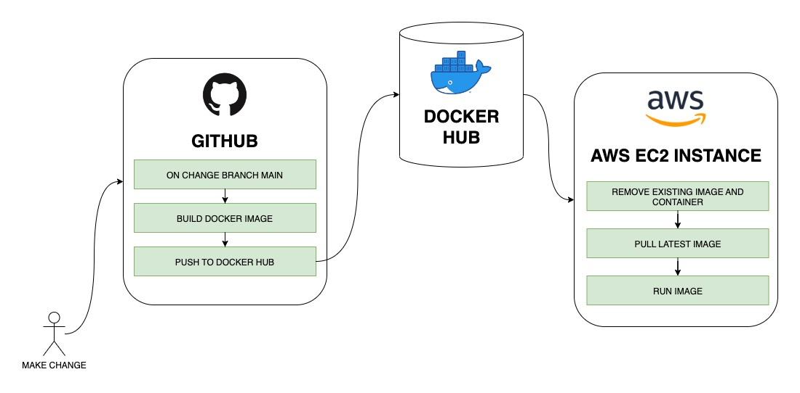

# Day 19 - CI/CD

Dalam tugas ini, saya melakukan otomasi deploy ke EC2 Instance menggunakan github action dari project sebelumnya [https://github.com/daimus/UpskilledD14_UnitTest](https://github.com/daimus/UpskilledD14_UnitTest).

Adapun alur pekerjaan yang dilakukan github action digambarkan dalam diagram berikut

## Docker Hub Repo

[https://hub.docker.com/r/daimus/product-service](https://hub.docker.com/r/daimus/product-service)

## Demo on AWS EC2

[http://54.255.19.15](http://54.255.19.15)

[http://54.255.19.15/swagger-ui.html](http://54.255.19.15/swagger-ui.html)